<div align="center">

# ⏻ Azure VM Scheduler

**Start and stop your Azure VM estate on a schedule — safely, in ringed waves, from your own subscription.**

Model your estate as *applications → rings → virtual machines*, attach start and stop schedules at
any level, and let the scheduler fan each occurrence out into an ordered wave of per-VM attempts —
with two independent safety gates standing between you and a real Azure power action.

[](https://portal.azure.com/#create/Microsoft.Template/uri/https%3A%2F%2Fraw.githubusercontent.com%2Fzmustafa%2FAzureVMScheduler%2Fmain%2Fdeploy%2Fmain.json)

[](LICENSE)
[](https://hub.docker.com/r/zmustafa/azure-vm-scheduler)
[](backend/pyproject.toml)
[](frontend/package.json)
[](https://fastapi.tiangolo.com/)
[](CONTRIBUTING.md)

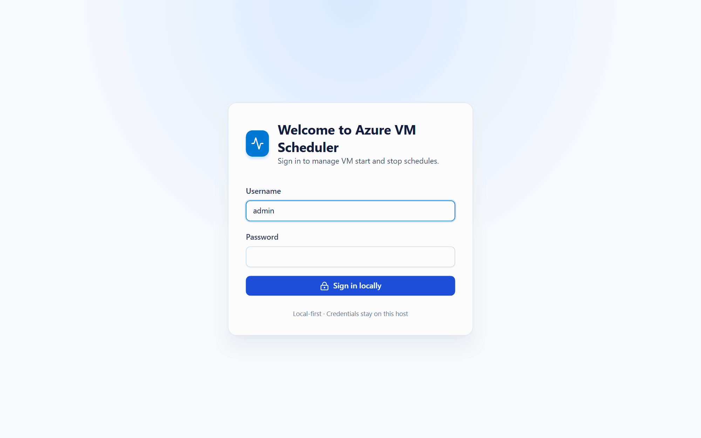

<em>The whole application, end to end, running against the built-in demo estate with both safety gates
off — note the mock-mode banners.</em>

</div>

---

## Why Azure VM Scheduler?

Turning non-production VMs off at night is the single easiest Azure saving there is — and the
easiest one to get badly wrong. Auto-shutdown policies act per VM with no idea what a machine
belongs to, Automation runbooks drift, and a hand-rolled script that stops the wrong tier at 19:00
is an outage, not a saving.

Azure VM Scheduler makes the *application* the unit of scheduling:

- 🏗️ **Estate-shaped, not VM-shaped** — an application holds rings, a ring holds VMs. Schedule the
  application and every ring inherits it; override one ring and only that ring changes.
- 🌊 **Ringed waves, staggered** — a start walks the rings in order, a stop unwinds them in reverse,
  with a configurable per-VM stagger so you never slam ARM.
- 🎯 **Never twice** — start and stop are resolved independently, and the nearest schedule wins, so a
  VM is never started twice nor stopped twice no matter how many schedules sit above it.
- 🛑 **Stops are treated as dangerous** — separate gates, `never_stop` protection, an explicit count
  confirmation, and a conflict guard that refuses to stop a machine a start wave is still working.
- 🔒 **Inert until you say otherwise** — every wave runs against a deterministic mock adapter until
  *two* independent switches are flipped. You can build, preview and rehearse an entire rollout
  without touching a real machine.
- 🏠 **Runs in your subscription** — one-click deploy to Azure Container Apps, or entirely on your
  laptop on SQLite. Credentials are Fernet-encrypted at rest and never leave the host.

> Built for platform teams, SREs, and anyone who owns a dev/test estate they would rather not pay
> for at 3am.

---

## Table of Contents

- [✨ Features](#-features)
- [🆕 What's new](#-whats-new)
- [🚀 Deploy to Azure (one-click)](#-deploy-to-azure-one-click)
  - [🕸️ Private networking deployment](#️-private-networking-deployment)
- [⚡ Quick start (local)](#-quick-start-local)
- [🧩 How it works](#-how-it-works)
- [⏰ Scheduling](#-scheduling)
- [🛡️ Safety model](#️-safety-model)
- [☁️ Azure tenants](#️-azure-tenants)
- [🔐 Authentication & access control](#-authentication--access-control)
- [🗺️ UI map](#️-ui-map)
- [📄 CSV import](#-csv-import)
- [🔔 Connectors & notifications](#-connectors--notifications)
- [🔧 Tech stack](#-tech-stack)
- [⚙️ Configuration reference](#️-configuration-reference)
- [💾 Data files & backup](#-data-files--backup)
- [🚧 Not in scope](#-not-in-scope)
- [🤝 Contributing](#-contributing)
- [📜 License](#-license)

---

## ✨ Features

| | |
| --- | --- |
| **🏗️ Two-level estate model**<br>Applications hold rings, rings hold virtual machines — exactly two levels, enforced everywhere (create, move, CSV, settings import). No accidental ten-deep trees, no ambiguity about what a schedule covers. | **⏱️ Start *and* stop waves**<br>Every schedule carries an action. Starts walk the rings forward; stops default to `reverse`, unwinding the last ring first. `deallocate` (stops compute billing) or `power_off`, chosen per schedule. |
| **🎯 Nearest-schedule resolution**<br>A VM schedule beats a ring schedule beats an application schedule — resolved independently per action. Each VM has at most one effective start and one effective stop, so nothing ever double-fires. | **🗓️ Real recurrence, DST-safe**<br>One-time, daily, weekly or full five-field cron with lists, ranges, steps and month/day names. Wall-clock times in an IANA zone: 08:00 stays 08:00 across a DST change, and a spring-forward gap is skipped, not shifted. |
| **🔮 Live preview before you save**<br>`POST /api/schedules/preview` describes any recurrence in plain English and returns its next five occurrences — computed by the same engine the scheduler runs, not a browser re-implementation. | **🚦 Bounded schedules**<br>`start_date`/`end_date` as local calendar bounds plus a `run_limit` budget. A spent or expired schedule flips to `completed` with no next run instead of sitting enabled and silently never firing. |
| **🛑 Stop protection**<br>`never_stop` on a VM or any ancestor removes it from every stop wave and every on-demand stop. On-demand stops must echo back the exact machine count. A conflict guard blocks acting on a VM with an opposite action in flight. | **🎭 Mock-first safety**<br>Real Azure calls need a global gate **and** the per-tenant permission, re-evaluated on every single attempt — so revoking a tenant permission halts a wave already in progress. Read-only tenants can never power anything. |
| **📊 Overview cockpit**<br>Readiness pre-flight checks, windowed KPIs with previous-period deltas, 14-bucket trends, a next-24h strip, the rollout plan, an application health matrix, reliability stats and a live activity feed. | **🕳️ Coverage-gap detection**<br>Finds VMs that start but never stop (burning money), stop but never start (surprise outage), and machines that are stop-protected — plus start/stop wave overlaps, in both directions. |
| **🔎 VM discovery & name resolution**<br>Paste bare VM names and let Azure Resource Graph work out subscription and resource group, browse a subscription, or paste full resource IDs. Ambiguous names are surfaced for you to choose; duplicates are blocked. | **📥 CSV import**<br>UTF-8 inventory CSV with a validating preview bound to an encrypted, expiring token — commit is atomic and rejects stale or tampered previews. The simplest valid file is a single column of VM names. |
| **▶️ On-demand power actions**<br>`POST /api/vms/power-action` runs a schedule-less wave over hand-picked machines. Plus manual run, run-level retry of failed attempts, and single-attempt retry from the run detail page. | **🧾 Full run forensics**<br>Every wave is a run; every VM is an attempt with status, mode, message, attempt number, sequence and correlation id. Run status rolls up to succeeded / partially failed / failed / timed out / cancelled. |
| **🔑 SSO: OIDC + SAML 2.0**<br>Any number of providers — Entra, any OIDC issuer via its discovery document, or SAML 2.0 verified with `signxml` (only the signed subtree is ever read). Authorization Code + PKCE, encrypted short-lived state, live JWKS validation. | **👥 Capability-based RBAC**<br>Users hold roles directly or through access groups; effective permissions are the union, resolved once per request. Built-in admin / operator / auditor / viewer / noaccess roles, re-seeded on every start, plus free-form custom roles. |
| **🧱 Server-side walls**<br>A `noaccess` allowlist, a forced-password-change allowlist, a per-IP brute-force throttle that catches one attacker spraying many usernames, and an IP access list that refuses unknown source addresses outright — all enforced on the API, not merely hidden in the UI. | **🔔 Connectors & notifications**<br>Teams, Slack, email (SMTP or Microsoft Graph), ServiceNow and signed generic webhooks. Severity / event / scope routing with quiet hours, throttles, and immediate, per-VM or daily-digest delivery on a bounded worker pool. |
| **🧪 Demo estate in one click**<br>Settings → Demo data loads a sample Zava estate (4 applications, 9 rings, 18 VMs, 7 start/stop waves). Removal deletes exactly what the loader created — never a real application that happens to share a name. | **📦 One image, one deployment**<br>The built SPA is served by FastAPI at the same origin, so there is no CORS story and no second container. SQLite locally, PostgreSQL in Azure — chosen purely by `DATABASE_URL`. |

### Enterprise-ready

🔒 Both real-action gates ship **off** · 🔐 Fernet-encrypted credential registries · 🧾 full audit log ·
👥 RBAC with users / roles / access groups · 🔑 OIDC + SAML SSO · 🚫 lock-out guards that return `409` ·
🌐 IP allowlist admission control · 🛡️ CSRF + same-origin enforcement + security headers on every
response · 🕸️ optional fully private networking (Private Endpoints for database and storage) ·
🏢 multi-tenant Azure connections · 🆔 managed-identity support with no stored secret at all.

---

## 🆕 What's new

### 🌐 IP access control — allowlist who can reach the app

Account lockout and the per-IP throttle blunt a brute-force attempt, but they do not remove the
exposure: with public ingress, anyone on the internet still gets to try. **Access control → IP
access** now refuses requests by source address *before* routing, session lookup or password
verification.

- **Three modes** — `disabled`, `audit` (record what would be refused, refuse nothing) and
  `enforce`. Audit lets you prove your rules are right before they can bite.
- **All-or-nothing on purpose** — when it is on, every request is filtered, API and web interface
  alike. Health probes are the only exemption, so "the firewall is on" means exactly one thing.
- **Normalized rules** — IPv4/IPv6 addresses or CIDR ranges, stored canonically (a bare address
  becomes `/32` or `/128`), so a rule can never read differently from how it behaves.
- **No amplification** — the compiled list lives in memory and is recompiled after every write, so a
  blocked request performs no database work at all. Refusals accumulate in a bounded buffer that the
  scheduler drains into coalesced `ip_block_events` rows.
- **Fails open, never closed, with four lock-out defences** — a `409` guard when the change would
  block your own address, auto-revert to `disabled` when the last rule is removed, a 15-minute
  commit-confirm timer on enabling enforcement, and the environment-only `IP_ALLOWLIST_BOOTSTRAP` /
  `IP_ALLOWLIST_DISABLED` break-glass pair that a container restart always honours.
- **Correct behind a proxy** — the client address is read `FORWARDED_HOPS` entries from the **right**
  of `X-Forwarded-For`, because each hop appends; reading the leftmost entry would let any client
  forge its own address and walk straight through the allowlist.
- **Defence in depth** — `deploy/main.bicep` also accepts an optional `allowedClientIps` array that
  filters at the Container Apps ingress, before traffic ever reaches the container.

It ships with an Overview readiness check, audit events and its own tab in the UI.
👉 Full details in [IP access control](#ip-access-control).

---

## 🚀 Deploy to Azure (one-click)

[](https://portal.azure.com/#create/Microsoft.Template/uri/https%3A%2F%2Fraw.githubusercontent.com%2Fzmustafa%2FAzureVMScheduler%2Fmain%2Fdeploy%2Fmain.json)

Provisions a managed PostgreSQL database, Azure Files state storage, and a Container App running the
public image — in **your** subscription, in one deployment. No CLI, no manual wiring.

What it creates:

1. **Azure Container App** running the public Docker image, single replica, HTTPS ingress
2. **Azure Database for PostgreSQL — Flexible Server** (Burstable `B1ms`), linked via `DATABASE_URL`
   with `?ssl=require`
3. **Azure Files** share mounted at `/app/.data` for the encryption key and the connection registry
4. **Container Apps environment** + Log Analytics workspace
5. A **system-assigned managed identity** on the Container App

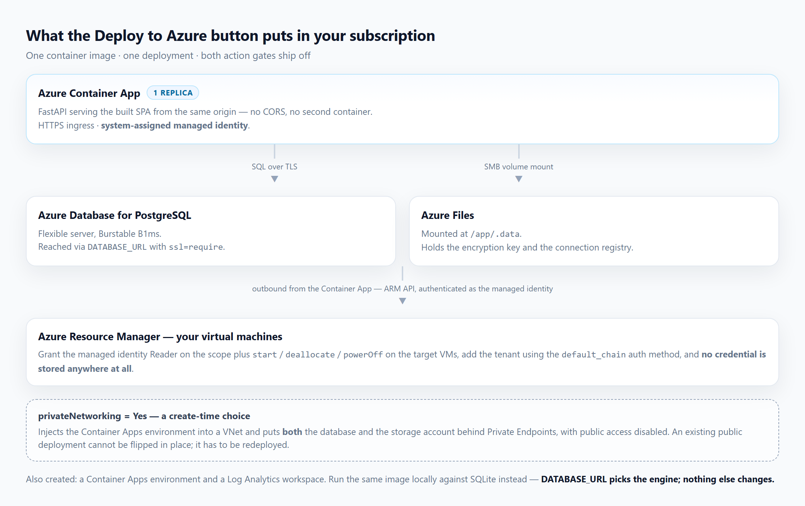

*Everything one deployment creates. The private-networking switch is create-time only — an existing
public deployment has to be redeployed, not flipped.*

You supply only an admin password, and you are forced to change it on first sign-in.

> ### ⚠️ It arrives inert
> `ENABLE_REAL_AZURE_STARTS` and `ENABLE_REAL_AZURE_STOPS` both default to `false`, so every wave
> runs against the mock adapter until you deliberately turn a gate on. Each gate is still ANDed with
> the per-tenant permission, so flipping one is necessary but not sufficient.

**🆔 Connecting Azure without storing a secret.** Grant the Container App's managed identity Reader on
the scope you want to manage, plus `start` / `deallocate` / `powerOff` on the target VMs, then add a
tenant in the app using the `default_chain` auth method. No client secret is stored at all.

> `deploy/main.json` is generated from `deploy/main.bicep` and is what the button reads — regenerate
> it with `az bicep build`, never hand-edit it.

### 🕸️ Private networking deployment

The same template also deploys the whole thing in a **fully private data-plane shape**. Set the
**Private networking** parameter to `Yes` (`privateNetworking=Yes`) — on the Deploy to Azure form or
on the CLI — and the deployment additionally provisions a VNet, injects the Container Apps
environment into it, and puts **both** PostgreSQL and the Azure Files storage account behind Private
Endpoints, with public network access **disabled** on each.

Nothing else about the application changes: same image, same `DATABASE_URL`, same `/app/.data`
mount. Only how the traffic reaches them changes.

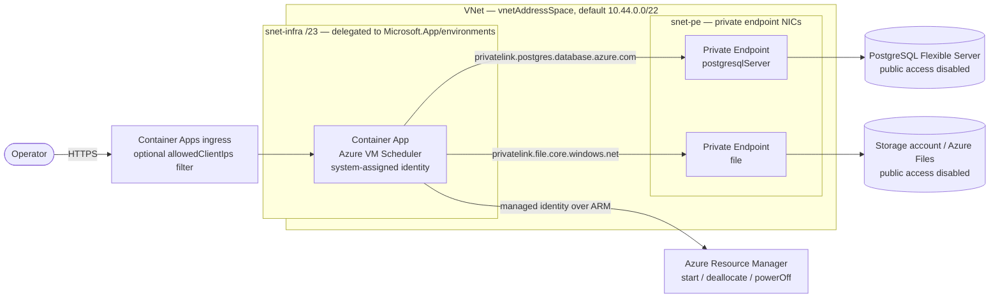

**What `privateNetworking = Yes` changes**

| Resource | Behaviour |
| --- | --- |
| **Virtual network** | Created with `vnetAddressSpace` and two subnets: `snet-infra`, delegated to `Microsoft.App/environments` and required to be **at least a `/23`**, and `snet-pe`, with private endpoint network policies disabled. |
| **Container Apps environment** | VNet-injected into `snet-infra`, so every outbound call the app makes originates inside the VNet. |
| **PostgreSQL Flexible Server** | `publicNetworkAccess: Disabled` — reachable only through its Private Endpoint. The `AllowAzureServices` firewall rule is **not** created, because firewall rules are a public-access construct. |
| **Storage account (Azure Files)** | `publicNetworkAccess: Disabled` and `networkAcls.defaultAction: Deny`, reached over a `file` Private Endpoint. Shared-key access stays enabled because the Container Apps Azure Files CSI driver authenticates with the account key. |
| **Private DNS** | `privatelink.postgres.database.azure.com` and `privatelink.file.<storage suffix>` zones are created, linked to the VNet and wired to each endpoint by a private DNS zone group — so the app keeps using the normal FQDNs and simply resolves them to private IPs. |

**Parameters**

| Parameter | Default | Notes |
| --- | --- | --- |
| `privateNetworking` | `No` | `Yes` turns the entire private shape on. **Create-time only.** |
| `vnetAddressSpace` | `10.44.0.0/22` | Pick a range that does not overlap networks you may later peer with. |
| `infraSubnetPrefix` | `10.44.0.0/23` | Container Apps requires a `/23` or larger. |
| `privateEndpointSubnetPrefix` | `10.44.2.0/27` | Must sit inside the address space and not overlap the infrastructure subnet. |
| `allowedClientIps` | `[]` | Optional CIDR filter applied at the ingress — see below. |
| `ipAllowlistBootstrap` | `''` | Break-glass CIDRs the app always admits, whatever its own IP access list says. |

**Deploying it from the CLI**

```powershell
az group create -n rg-vmscheduler -l westus3

az deployment group create `
  -g rg-vmscheduler `
  -f deploy/main.bicep `
  -p appName=azure-vm-scheduler `
     adminPassword='<bootstrap-admin-password>' `
     privateNetworking=Yes `
     vnetAddressSpace=10.44.0.0/22 `
     infraSubnetPrefix=10.44.0.0/23 `
     privateEndpointSubnetPrefix=10.44.2.0/27
```

Add `allowedClientIps="['203.0.113.0/24']"` to filter the ingress in the same deployment.

> #### ⚠️ Create-time only
> A Container Apps environment's VNet configuration and a Flexible Server's public-access setting are
> both fixed when the resource is created, so an existing `No` deployment **cannot be flipped to
> `Yes`** in place. It has to be redeployed, moving the estate across with **Settings → Backup &
> restore**: export from the old deployment, import into the new one.

**What private networking does *not* do.** It privatises the *data plane* — database and file
storage. The application's own ingress stays external HTTPS, because that is how you reach the web
interface. Restrict who can reach it with the two complementary layers:

1. `allowedClientIps` — source CIDRs allowed at the Container Apps ingress, applied before a request
   ever reaches the container and unspoofable by a forwarded header. Recovery from a mistake here
   needs the Azure control plane:
   `az containerapp ingress access-restriction remove -n <app> -g <rg> --rule-name <name>`.
2. **Access control → IP access** — the fine-grained, UI-editable allowlist inside the app, with an
   audit mode, a commit-confirm timer and break-glass environment variables. See
   [IP access control](#ip-access-control).

**Notes and limits**

- The PostgreSQL private DNS zone name is fixed to the Azure **public** cloud
  (`privatelink.postgres.database.azure.com`); sovereign clouds use a different zone name and need
  the template adjusting.
- `snet-infra` still needs outbound access to pull the container image and to call Azure Resource
  Manager. If you later attach a firewall or route table to that subnet, allow the Container Apps
  and ARM dependencies, or the app cannot power anything.
- Replicas stay pinned at 1/1 in both shapes — the scheduler runs in-process and is single-writer by
  design.

---

## ⚡ Quick start (local)

**Prerequisites:** Python 3.12+, Node.js 22+, npm. Docker optional.

```powershell
git clone https://github.com/zmustafa/AzureVMScheduler.git
cd AzureVMScheduler
```

### Option A — Docker Compose (closest to production)

```powershell
Copy-Item .env.example .env      # change BOOTSTRAP_ADMIN_PASSWORD first
docker compose up --build        # http://localhost:8000
```

One container serving both API and UI, backed by PostgreSQL — exactly the shape the cloud runs.

### Option B — Native dev servers (hot reload)

```powershell
# Backend
python -m venv .venv
.\.venv\Scripts\Activate.ps1
pip install -r backend/requirements.txt
Copy-Item .env.example .env      # set BOOTSTRAP_ADMIN_PASSWORD before first startup
cd backend
python -m uvicorn app.main:app --reload --host 127.0.0.1 --port 8000

# Frontend (second terminal, from the repo root)
npm --prefix frontend install
npm --prefix frontend run dev    # http://127.0.0.1:5173
```

Vite serves the UI on `127.0.0.1:5173` and proxies `/api` to the backend on `127.0.0.1:8000`. With no
`DATABASE_URL` the app creates SQLite at `.data/azureops.db` and needs no other service. Sign in with
`BOOTSTRAP_ADMIN_USERNAME` (default `admin`) and the password you set — a password change is forced
immediately.

VS Code tasks **Azure VM Scheduler: backend** and **Azure VM Scheduler: frontend** run the same two
servers. They are defined but never launched automatically.

> 💡 First time here? Load **Settings → Demo data** for a fully populated sample estate with
> applications, rings, VMs and start/stop waves, then remove it in one click.

### Tests

```powershell
.\.venv\Scripts\python.exe -m pytest backend/tests -q
npm --prefix frontend run build   # tsc -b + vite; catches types the dev server tolerates
npm --prefix frontend run lint
```

Full development instructions, including running the suite against PostgreSQL, live in
[CONTRIBUTING.md](CONTRIBUTING.md).

### Health endpoints

| Path | Meaning |
| --- | --- |
| `/healthz`, `/api/health` | Process is up (liveness) |
| `/readyz` | Database is reachable (readiness); `503` when it is not |
| `/api/meta` | Name, image version, environment |

---

## 🧩 How it works

The whole app — the FastAPI API plus the built React SPA — ships as **one container image** and runs
as a single Container App. The static mount is registered last so it can never shadow `/api`.

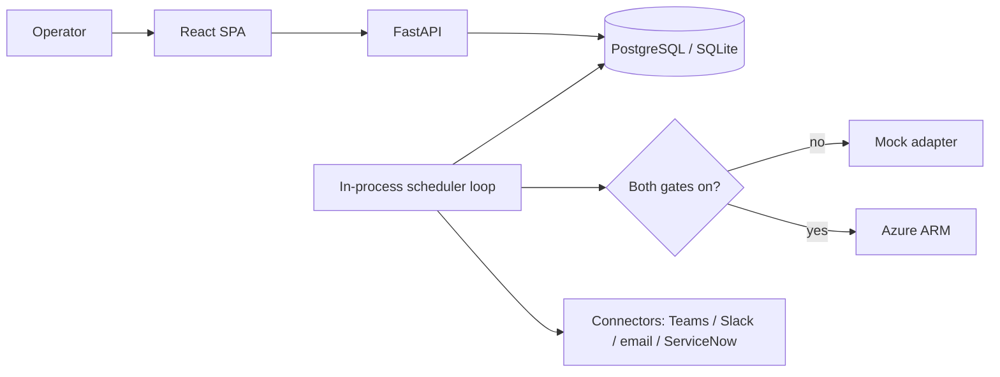

> **Single replica only.** The in-process scheduler claims work with database leases sized for one
> instance, so the deployment template pins `minReplicas`/`maxReplicas` to 1. Running two replicas
> risks firing a wave twice and is not supported.

### Domain model

```text
groups (exactly two levels)
  depth 0  -> Application
  depth 1  -> Ring (a ring can never contain another ring)
    └── virtual_machines   (inventory rows, each belongs to exactly one group)

schedules      -> action = 'start' | 'stop', target_type = 'group' | 'vm', target_id = that group/VM id
                  recurrence = one_time | daily | weekly | cron, bounded by dates and a run limit
schedule_runs  -> one occurrence (a "wave") of a schedule
vm_attempts    -> one row per VM inside a run
```

| Table | Purpose |
| --- | --- |
| `groups` | Applications and their rings, with materialised `path`, `depth` (0 or 1), `sequence`, optional `azure_connection_id`, `enabled`, `never_stop` |
| `virtual_machines` | `group_id`, `vm_resource_id` plus unique `normalized_resource_id`, parsed subscription/resource group/VM name, optional connection override, `enabled`, `never_stop`, `notes`, cached `last_power_state`/`last_power_state_at` |
| `schedules` | `action`, `stop_mode`, `ring_order`, `schedule_type`, `start_time`, `cron_expression`, `weekday`, `timezone`, `start_date`/`end_date`, `run_limit`/`run_count`, `target_type`/`target_id`, `stagger_seconds`, optional `azure_connection_id`, `next_run_at`, `lease_owner`/`lease_until` |
| `schedule_runs` | One wave: `action`, `stop_mode`, `status`, `mode`, `trigger`, counts for total/succeeded/failed/skipped |
| `vm_attempts` | Per-VM outcome: `action`, `stop_mode`, `status`, `mode`, `message`, `attempt_number`, `sequence`, `correlation_id`, timestamps |
| `import_batches`, `audit_logs`, `users`, `login_sessions`, `security_policy` | Supporting tables |
| `roles`, `access_groups`, `user_roles`, `user_access_groups`, `identity_providers` | Access control: capability sets, role bundles, their assignments, and SSO directories |
| `ip_allow_rules`, `ip_block_events` | IP access control: allowed source ranges, and coalesced refusals |

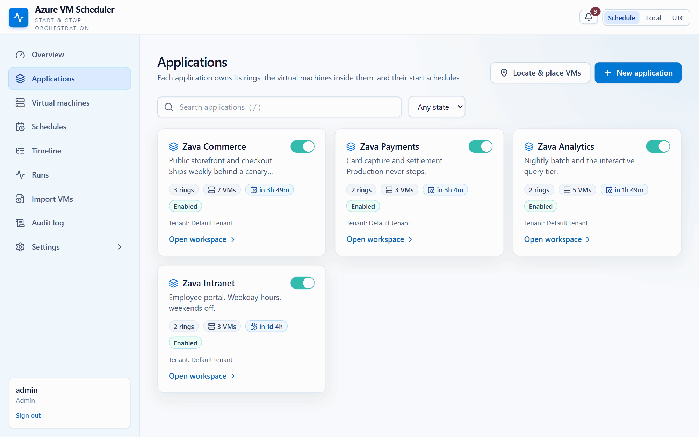

*The ring board for one application. The sequence number on each ring is the whole ordering model —
there is nothing else to configure.*

### Resolution rules

**Which schedule acts on a VM** (`hierarchy.effective_schedule`), resolved **independently per
action** so a VM can have both a start wave and a stop wave:

1. A schedule that targets the VM directly wins.
2. Otherwise the **nearest** ancestor group schedule wins — a ring schedule shadows its application's
   schedule.
3. Every VM therefore has at most one effective schedule *per action*, so **a VM is never started
   twice, and never stopped twice**.

When a group schedule builds its wave it selects the VMs in its subtree that are enabled, whose whole
ancestor chain is enabled, and whose effective schedule for that action is that same schedule. VMs
shadowed by a nearer schedule are excluded.

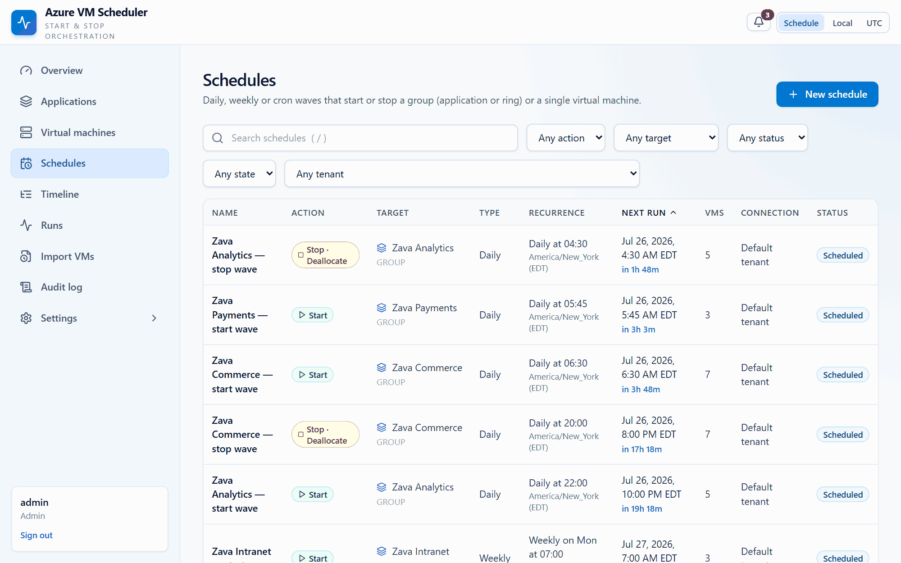

*A wave running. Each row appears as its machine's turn comes up, in ring order, one stagger interval
apart.*

**Which Azure connection is used** (`hierarchy.effective_connection_id`):

1. The VM's own `azure_connection_id` override, else
2. the nearest ancestor group's `azure_connection_id`, else
3. the enabled default connection from the tenant registry.

### Stop waves

Stops are treated as more dangerous than starts throughout: a wrong start costs money, a wrong stop
causes an outage.

- **Independent gates.** `ENABLE_REAL_AZURE_STOPS` and the tenant's `allow_vm_stop` are separate from
  their start equivalents. Enabling real starts never enables real stops.
- **`stop_mode`** is `deallocate` (default — releases the host and stops compute billing) or
  `power_off` (guest shuts down, host stays reserved and billed).
- **`ring_order`** defaults to `reverse` for stops, unwinding the last ring first to mirror the start
  order.
- **`never_stop`** on a VM or any ancestor group makes the machine invisible to every stop wave and to
  on-demand stops. Starts ignore the flag entirely.
- **Conflict guard.** Before submitting, a wave refuses to act on a VM that has an opposite-action
  attempt still in flight, so a start and a stop can never race over one machine.
- **On-demand.** `POST /api/vms/power-action` runs a schedule-less wave over hand-picked machines. A
  stop refuses outright if any selected machine is protected, and requires the exact machine count
  echoed back in `confirm_count`.

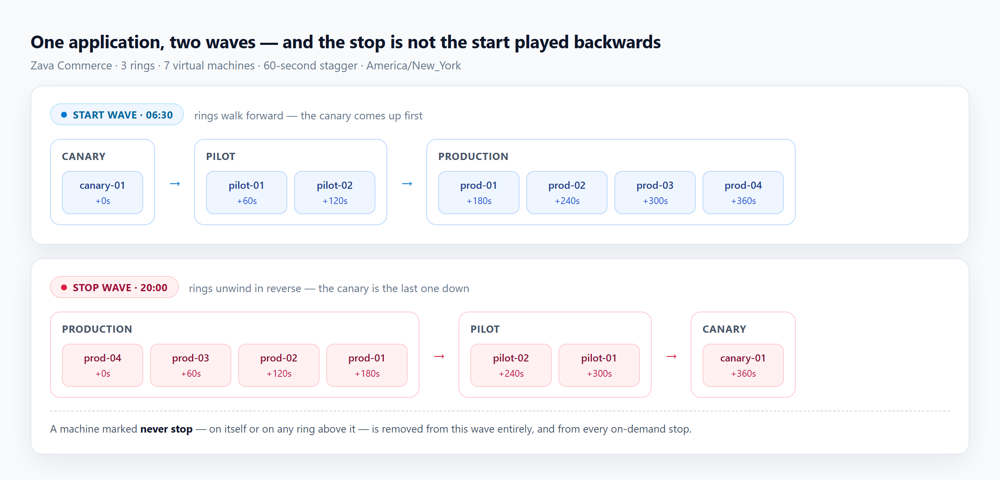

*One application, two waves. Read the stop row right to left and you have the start row — that is the
point.*

---

## ⏰ Scheduling

- **Frequencies:** `one_time`, `daily`, `weekly` and `cron`. `daily` and `weekly` are stored as
  friendly fields and translated to cron internally, so there is exactly one occurrence engine
  (`app/recurrence.py`) to reason about; `one_time` is the only special case.
- **Cron** is the standard five-field form `minute hour day-of-month month day-of-week`, with `*`,
  lists, ranges, steps and three-letter month/day names. Sunday is `0` (and `7` is accepted). When
  both day fields are restricted, a day matches if **either** does, as cron defines it.
- **DST-safe by construction.** Times are stored as wall-clock text plus an IANA `timezone` and
  evaluated with `zoneinfo`: an occurrence landing in a spring-forward gap is **skipped**, not
  shifted, and 08:00 stays 08:00 either side of a transition.
- The default timezone is **`America/New_York`**, configurable under **Settings**
  (`security_policy.default_timezone`) and by the `DEFAULT_TIMEZONE` environment variable.
- **Bounds:** `start_date` and `end_date` are local calendar dates in the schedule's own timezone, and
  `run_limit` caps the number of **scheduler-triggered** runs (`run_count` tracks them; manual runs
  never spend the budget). A schedule whose window has closed or whose budget is spent moves to status
  `completed` with no next run, rather than sitting enabled and never firing.
- `stagger_seconds` spreads the per-VM attempts inside a single wave; `ring_order` controls the
  direction a group wave walks its rings.
- `schedule_missed_grace_seconds` (default 300) controls how far in the past a `one_time` start may be
  before it is rejected, and bounds missed-run catch-up.
- Waves are claimed with a database lease (`lease_owner`/`lease_until`) so a restart mid-wave does not
  double-fire.
- `POST /api/schedules/preview` describes a recurrence and returns its next five occurrences without
  saving anything. The editor calls it as you type, so cron and DST are answered by the same engine
  the scheduler runs rather than being re-implemented in the browser.
- Run status rolls up from attempts: `succeeded`, `partially_failed`, `failed`, `timed_out`,
  `cancelled`, or `running`. Mode rolls up to `mock`, `real`, or `mixed`.
- Manual run, run-level retry of failed attempts, and single-attempt retry are available from the run
  and schedule detail pages.

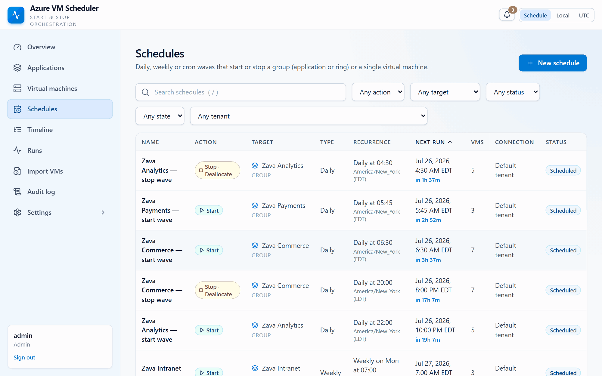

*Watch the right-hand panel as the cron expression is typed. That description and those five dates
come back from the server on every keystroke — from the same engine that fires the schedule.*

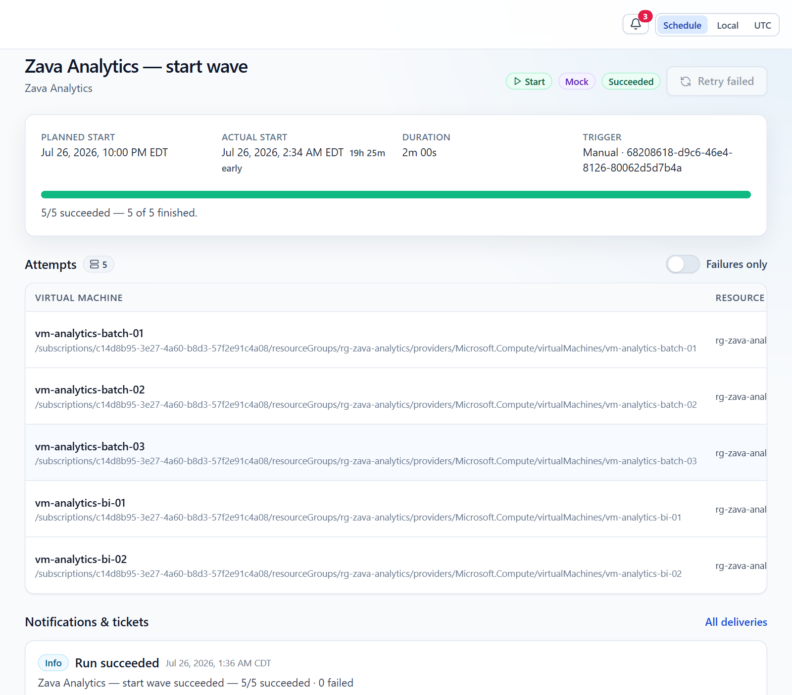

*One wave, after the fact: the mode it ran in, the correlation id, the roll-up, and every machine it
touched.*

### Scheduler tuning

| Variable | Default | Meaning |
| --- | --- | --- |
| `SCHEDULER_POLL_SECONDS` | 15 | How often the loop looks for due schedules |
| `SCHEDULER_LEASE_SECONDS` | 900 | Lease length; raised automatically to at least `VM_MONITOR_TIMEOUT_SECONDS + 60` |
| `SCHEDULER_CLAIM_BATCH` | 50 | How many due schedules are claimed per poll |
| `SCHEDULER_START_CONCURRENCY` | 12 | Concurrent start calls in flight |
| `SCHEDULER_MONITOR_CONCURRENCY` | 40 | Concurrent power-state polls in flight |
| `AZURE_SUBSCRIPTION_CONCURRENCY` | 8 | Per-subscription cap, to stay under ARM throttling |
| `AZURE_START_MAX_RETRIES` | 4 | Retries for transient Azure errors |
| `VM_MONITOR_TIMEOUT_SECONDS` | 600 | How long a VM may stay in `monitoring` before `timed_out` |
| `VM_MONITOR_INTERVAL_SECONDS` | 15 | Power-state poll interval |

**Why claim batch is decoupled from concurrency:** claiming is a cheap database lease and should cover
every schedule that becomes due in the same moment, otherwise a wide wave would be spread across
several poll cycles and drift past its start time. Actual Azure pressure is governed separately by the
start, monitor and per-subscription concurrency limits, which are what ARM throttling reacts to.
Claiming 50 schedules while only 12 start calls are in flight is the intended shape.

---

## 🛡️ Safety model

Starts and stops are gated **separately**, and each requires **both** of its gates:

| Action | Global gate | Tenant gate |
| --- | --- | --- |
| ▶️ Start | `ENABLE_REAL_AZURE_STARTS=true` | `allow_vm_start = true` |
| ⏹️ Stop | `ENABLE_REAL_AZURE_STOPS=true` | `allow_vm_stop = true` |

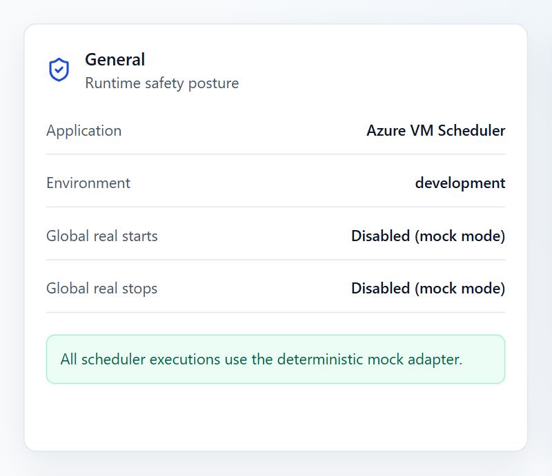

*The gates are a visible posture, not a buried environment variable. This is what a fresh deployment
looks like, and what it keeps looking like until somebody changes it.*

The pairs are deliberately independent: turning on real starts grants no permission to stop anything.
If either gate for an action is off, the deterministic **mock adapter** runs and the attempt is
recorded with `mode = mock`. Connections flagged `read_only` can never start or stop VMs. When a
global gate is enabled, a missing, disabled, read-only or write-blocked connection **fails** the
operation rather than silently downgrading to mock success.

Permissions are re-evaluated **on every attempt**, not cached: marking a tenant read-only, withdrawing
an action, disabling the connection, or turning off a global gate takes effect on the very next
virtual machine — which is what makes those switches usable to halt a wave in progress. Only the ARM
credential itself is cached. A permission flag missing from a stored connection reads as **denied**, so
a record written before a gate existed can never be treated as granting it.

Stops carry two further protections that starts do not: the `never_stop` flag (on a VM or any ancestor
group) removes a machine from every stop wave, and an on-demand stop must echo back the exact number of
machines it will act on.

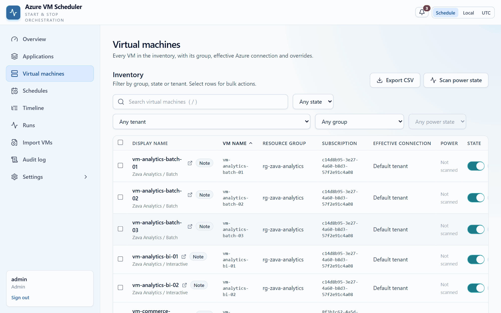

*Eighteen machines selected, but the dialog offers to stop sixteen — two are `never_stop` and it says
so. The confirm button stays dead until `16` is typed.*

---

## ☁️ Azure tenants

Tenants live in an encrypted local registry (`.data/azure_connections.json`, encrypted with
`.data/secret.key`). Supported authentication methods:

| Method | Description |
| --- | --- |
| `azure_cli` | Reuse the host's existing `az login` session |
| `default_chain` | Azure Identity non-interactive default credential chain — use this with a managed identity |
| `service_principal` | Tenant ID + client ID + client secret |
| `service_principal_cert` | Tenant ID + client ID + PEM certificate/private key bundle |
| `az_cli_token` | Pasted token or `az account get-access-token` JSON — short-lived, unsuitable for unattended schedules |

Each tenant carries `allow_vm_start`, `allow_vm_stop`, `read_only`, `disabled`, `is_default`, and a
last-known `status`. **Test** validates credentials and **Discover** lists reachable subscriptions.
Azure is contacted only when one of those actions is clicked, when VMs are added from Azure, or when a
real-mode start or stop runs.

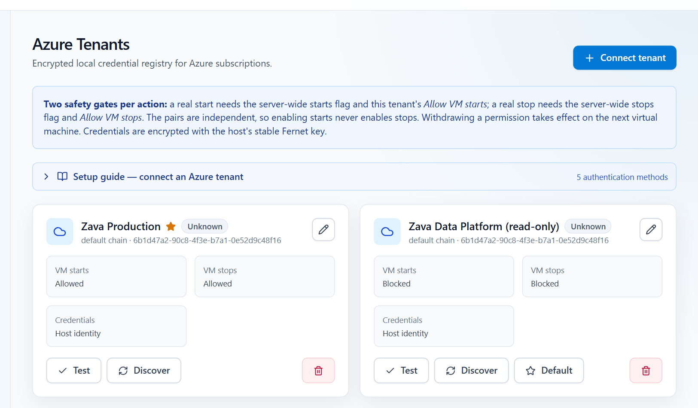

*Two tenants, one writable and one read-only, both authenticating as the host identity. The per-tenant
permissions are the second half of every gate.*

### Adding virtual machines

The **Add virtual machines** drawer on any application or ring offers three routes:

| Method | When to use it | Azure calls |
| --- | --- | --- |
| Paste resource IDs | You already have full `/subscriptions/.../virtualMachines/...` IDs | none |
| Resolve VM names | You only have bare names such as `vm-web-01` | Resource Graph, or a per-subscription scan |
| Browse a subscription | You want to pick from everything in one subscription | ARM VM list |

**Resolve VM names** takes a pasted list of plain names — one per line, or separated by commas,
semicolons, tabs or spaces — and searches the selected tenant for each one, working out the
subscription and resource group automatically. Duplicates are removed before the lookup. Every name
comes back as one of:

- ✅ **Resolved** — exactly one match; pre-selected for import.
- ⚠️ **Multiple matches** — the same name exists in more than one resource group or subscription, so
  you choose the right one before it can be added.
- ❌ **Not found** — nothing with that name is visible to the tenant.

Matches already in the inventory are shown with the group they belong to and cannot be added twice, and
any name can be skipped. The lookup can be narrowed to specific subscription IDs.

Resolution prefers **Azure Resource Graph**, which queries every accessible subscription in one call
and needs `Microsoft.ResourceGraph/resources/read` on the identity. If Resource Graph is not available,
the app automatically falls back to enumerating each visible subscription with reader access, and the
UI reports which path was used.

---

## 🔐 Authentication & access control

- **Local:** Argon2 password hashing, configurable password complexity, lockout after repeated
  failures, idle and absolute session expiry, DB-backed revocable sessions, and CSRF tokens on all
  mutating requests.
- **Single sign-on:** any number of providers, of three kinds — `entra` (OIDC with the issuer derived
  from a directory id), `oidc` (any compliant issuer, read from its discovery document), and `saml`
  (SAML 2.0, verified with `signxml`). All use Authorization Code + PKCE where applicable; OIDC state is
  encrypted, short-lived and bound to a validated return URL, and ID tokens are checked against the
  issuer's live JWKS. No provider endpoint is contacted until someone starts a sign-in.
- **Just-in-time provisioning** with directory-group-to-role mapping, re-applied on every sign-in. The
  account match is the signed `(provider, subject)` pair. Email linking is allowed **only** onto an
  account that is already SSO-managed — never one with a password — and only when the provider asserts
  the address is verified, so a crafted assertion claiming `email=admin` cannot seize the local
  administrator.
- **Redirect URIs:** each provider has its own. The Sign-in & SSO editor shows the exact values to
  register — `…/api/auth/oidc/{id}/callback` for OIDC, or the ACS and metadata URLs for SAML.
- **Break-glass admin:** the bootstrap administrator is protected and can still sign in locally even
  when normal local login is disabled. It cannot be disabled or deleted.

### Server-side walls

Three protections are enforced on the API, not just in the UI, so a scripted client cannot skip them:

| Wall | Effect |
| --- | --- |
| `noaccess` | A principal with zero effective permissions is refused every path except self and sign-out. This is what makes `noaccess` the safe default for auto-provisioned users. |
| `must_change_password` | Blocks every path except changing the password, so a fresh deployment cannot be driven while still on its bootstrap credential. |
| Per-IP throttle | Counts failed sign-ins per source over a sliding window and locks that address out for a cooldown — catching one attacker spraying many usernames, which no single account lockout would notice. Configurable under Policies. |
| IP access list | Refuses requests from source addresses that are not on an allowlist, before routing, session lookup or password verification. See below. |

Writes also require a matching CSRF token **and** a same-origin `Origin`/`Referer`, and every response
carries `Content-Security-Policy`, `X-Frame-Options: DENY`, `X-Content-Type-Options`, `Referrer-Policy`
and `Permissions-Policy`.

### IP access control

Throttling blunts brute force; not receiving the attempt at all removes it. **Access control → IP
access** restricts which source addresses may reach the app, in three modes — `disabled`, `audit`
(record what would be refused, refuse nothing) and `enforce`.

It is deliberately all-or-nothing: when it is on, **every** request is filtered, the API and the web
interface alike. Health probes are the only exemption, because a failing probe would restart the
container forever. An earlier design let it cover only the sign-in endpoints; that read as a safety
feature but was really a trap, because "the firewall is on" then meant two different things.

Rules are IPv4/IPv6 addresses or CIDR ranges, stored normalized (a bare address becomes `/32` or
`/128`), so a rule can never read differently from how it behaves. The compiled list lives in memory
and is recompiled after every write, so a blocked request costs no database work at all; refusals
accumulate in a bounded buffer that the scheduler drains into coalesced `ip_block_events` rows.

Because the danger of this feature is locking yourself out, it fails open at every turn:

| Layer | Behaviour |
| --- | --- |
| Guard | Enabling `enforce`, or removing the rule that admits you, is refused with `409` when the result would block your own address. |
| Empty list | `enforce` with no enabled rules filters nothing, and the mode reverts to `disabled` rather than showing an "Enforcing" banner over an open door. |
| Commit-confirm | Enabling enforcement arms a 15-minute timer; unless you confirm from the page, it reverts to `audit` by itself. Recovery with no Azure access at all. |
| Break-glass | `IP_ALLOWLIST_BOOTSTRAP` (always-allowed CIDRs) and `IP_ALLOWLIST_DISABLED` (kill switch) are environment-only, so a container restart always restores access. |

Behind a proxy the client address is read `FORWARDED_HOPS` entries from the **right** of
`X-Forwarded-For` (default 1, correct for Container Apps ingress), because each hop appends — reading
the leftmost entry would let any client forge its own address. `GET /api/access/ip-rules/my-ip`
reports what the server resolved, which is the diagnostic if the hop count is wrong.

For defence in depth, `deploy/main.bicep` also accepts an optional `allowedClientIps` array that
filters at the Container Apps ingress, before traffic reaches the container.

### Roles and capabilities

Everything lives on one page, **Access control** (`/access`), gated on the `users.manage` capability,
with seven tabs: Users, Roles, Access groups, Sessions, Policies, IP access, and Sign-in & SSO.

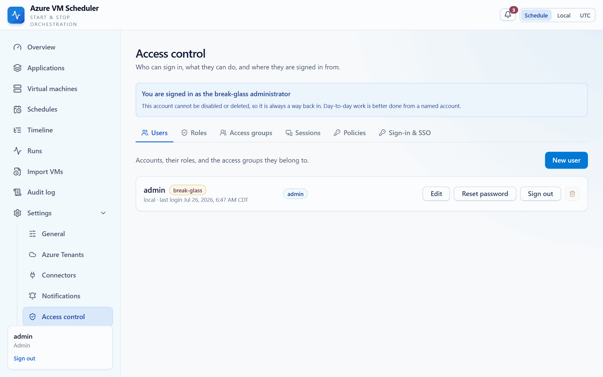

*Users, roles, access groups, live sessions, sign-in policy and the SSO providers — one page, one
permission to reach it.*

Authorization is capability-based. A user holds any number of **roles**, directly or through an
**access group**; their effective permissions are the union of all of them, resolved once per request.
Capabilities are declared in one place, `backend/app/permissions.py`, grouped into Overview, Estate,
Scheduling, Operations, Integrations, and Administration.

| Built-in role | Permissions |
| --- | --- |
| `admin` | Everything (`*`), including users, roles, sessions, policy, tenants, connectors and settings |
| `operator` | Read and write for applications/rings, VMs, schedules and imports; read runs, dashboard and connectors; manage notification rules |
| `auditor` | Read-only for applications/rings, VMs, schedules, runs, dashboard, connectors, notifications, **plus** the audit log |
| `viewer` | Read-only for applications/rings, VMs, schedules, runs, dashboard, connectors, notifications |
| `noaccess` | Nothing — for provisioned accounts that are not entitled yet |

Built-in roles are owned by the application and re-seeded on every start, so a capability added by an
upgrade is never left unusable. They cannot be renamed or deleted. Custom roles are free-form over the
same catalog.

An **access group** is a named bundle of roles, so a directory group or a team can be mapped once rather
than per user. Note the deliberate naming: `access_groups` is authorization, while `groups` remains the
application/ring hierarchy that schedules target.

Two lock-out guards are always enforced, on both the API and the UI: at least one enabled user must keep
a role granting `users.manage`, and local login cannot be disabled unless an enabled SSO provider exists.
Either violation returns `409` with the reason.

**Policy defaults:** password minimum length 12 with upper, lower, number and symbol required; lockout
after 5 failures for 15 minutes; 60-minute idle and 12-hour absolute session limits; missed-run grace
300 seconds. All editable under **Access control → Policies**.

---

## 🗺️ UI map

| Page | Route | What it does |
| --- | --- | --- |
| Overview | `/` | Readiness checks, windowed KPIs with trend, next-24h strip, rollout plan, application health matrix, coverage gaps, reliability stats and an activity feed |
| Applications | `/applications`, `/applications/:groupId` | Application workspace and ring board: create, rename, move and reorder rings, attach schedules and connection overrides, review VMs per ring |
| Locate & place VMs | `/applications/locate` | Paste any list of VM names, see which are already covered by an application, and file the rest into an existing group or a brand new application |
| Virtual machines | `/vms` | Flat inventory with filtering, bulk enable/disable/move/delete, per-VM connection override, on-demand Azure power-state scan |
| Schedules | `/schedules`, `/schedules/:id` | Create and edit group or VM schedules, view resolved VMs, manual run, attempts |
| Timeline | `/timeline` | Upcoming waves laid out in time order |
| Runs | `/runs`, `/runs/:id` | Run history over a chosen time window, activity timeline with a detailed log, per-VM attempt detail, retry failed |
| Import VMs | `/import` | Preview and commit the inventory CSV |
| Azure Tenants | `/settings/tenants` | Tenant registry, test, discover subscriptions, resolve VM names, live VM discovery |
| Settings | `/settings` | Default timezone, scheduler tuning, backup & restore, demo data, danger zone |
| Access control | `/access` | Users, roles, access groups, sessions, security policy, IP access list, sign-in & SSO |
| Audit log | `/audit` | Filterable audit history |

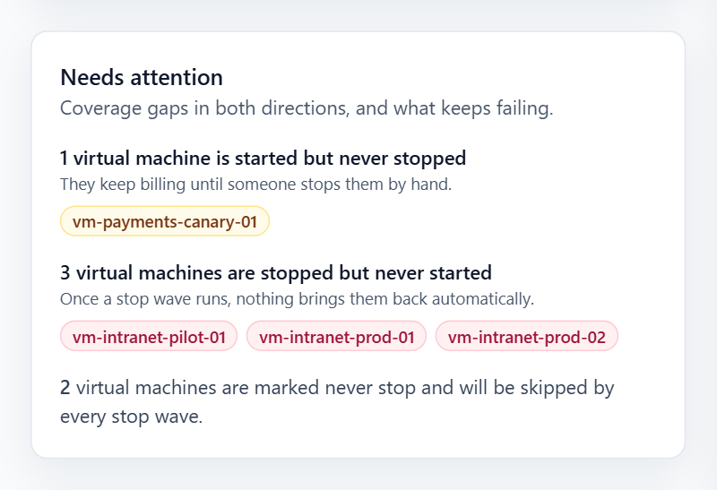

*The Overview finds partial coverage in both directions. The middle one — machines that stop tonight
and are never started again — is the one that ruins a Monday.*

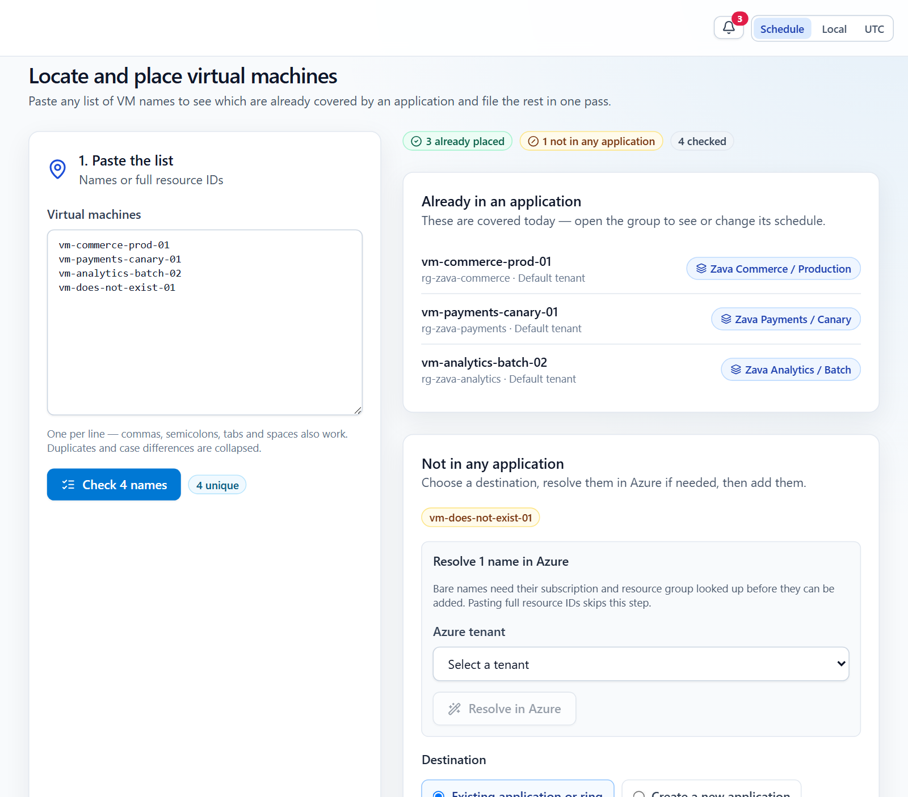

*Four names in. Three are already filed and it tells you exactly which ring holds each; the fourth is
unknown and gets offered a tenant to resolve against.*

Navigation entries are hidden when the signed-in user lacks the matching permission.

The header carries a global **display timezone switch** — `schedule` (each row in its own schedule's
zone, the default), `local` (browser zone), or `utc`. The choice is stored in `localStorage`.

The UI is **light mode only** — there is no dark theme and none should be added.

---

## 📄 CSV import

UTF-8 CSV up to 2 MB. Preview validates every row and returns an encrypted, expiring token bound to the
exact normalized rows; commit rejects stale or tampered previews and is atomic.

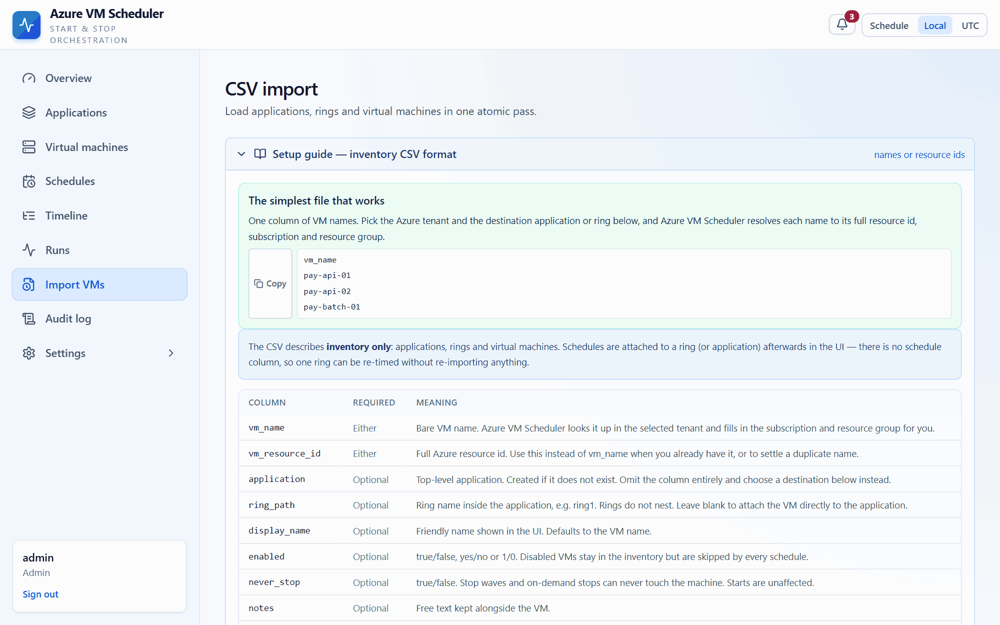

*Nothing is written during a preview. The commit is all-or-nothing, and a preview that has gone stale
is refused rather than partly applied.*

The format is detected from the headers: a file containing a `schedule_type` column is treated as the
legacy schedule format, everything else as inventory. Every row identifies its VM by **either**
`vm_name` **or** `vm_resource_id`.

### Simplest file — just names

```csv
vm_name
pay-api-01
pay-api-02
pay-batch-01
```

Choose an **Azure tenant** and a **destination application or ring** on the import page. Bare names are
resolved in a single Azure Resource Graph query for the whole file, filling in each VM's subscription
and resource group. Rows resolved this way inherit the resolving tenant as their connection override. A
name that matches nothing, or matches more than one VM, is reported per row — add a `vm_resource_id`
for that row to settle a duplicate.

### Full form

| Column | Required | Meaning |
| --- | --- | --- |
| `vm_name` | either | Bare VM name, resolved against the selected tenant |
| `vm_resource_id` | either | Full Azure VM resource ID; skips name resolution |
| `application` | no | Depth-0 group name; created if missing. Omit the column and pick a destination in the UI instead |
| `ring_path` | no | A single ring name below the application; created if missing. Leave blank to place the VM directly on the application |
| `display_name` | no | Defaults to the VM name |
| `enabled` | no | `true`/`false`, `yes`/`no`, `1`/`0` (default `true`) |
| `notes` | no | Free text |
| `azure_connection` | no | Tenant UUID or exact display name; otherwise the effective connection is inherited |

```csv
application,ring_path,vm_name,display_name,enabled,notes,azure_connection
Payments,Ring 0/Canary,vm-pay-canary,Payments canary,true,First wave,Production
Payments,Ring 1,vm-pay-web1,Payments web 1,true,,Production
Payments,Ring 2,vm-pay-web2,Payments web 2,true,,
Reporting,,vm-rpt-01,Reporting node,false,Held back,
```

**The CSV carries inventory only — there are no schedule columns.** Start times are attached to
applications, rings or individual VMs in the UI after import. Preview reports which applications and
rings would be created, how many VMs would be added, duplicate resource IDs inside the file, and VMs
already present in the inventory.

---

## 🔔 Connectors & notifications

Every published event lands in the in-app feed first, so nothing is lost even when no routing rule
exists. Read/unread state is tracked per account, so one viewer cannot clear another viewer's badge.
Rules then decide what leaves the box.

**Events:** `run.succeeded`, `run.partially_failed`, `run.failed`, `run.timed_out`, `vm.start_failed`,
`vm.start_timed_out`, `vm.start_skipped`, `schedule.missed` (critical, emitted exactly once per
occurrence), `connection.unhealthy`.

**Connector types:** email (`smtp` or `m365_graph`), Microsoft Teams, Slack, ServiceNow, and a signed
generic webhook. Configuration lives in `.data/connectors.json` with every secret field
Fernet-encrypted; the API only ever returns `{field}_set: true|false`, and leaving a secret blank on
edit keeps the stored value.

**Routing rules** match on severity threshold (`info` < `warning` < `error` < `critical`), event type
allowlist (empty means any), and an optional group scope that can include the subtree. They also carry
quiet hours (with a critical override), a throttle window, and a delivery mode:

| `digest_mode` | Behaviour |
| --- | --- |
| `immediate` (default) | One message per wave. A 30-VM ring that loses 6 VMs sends **one** "24/30 succeeded · 6 failed" message; per-VM events stay in the feed only. |
| `per_vm` | Also fans out one message per failed VM. |
| `daily` | Nothing is sent immediately; everything rolls into one digest at `digest_hour` in `digest_timezone` (DST-safe, restart-safe via `last_digest_at`). |

**Delivery** runs on its own bounded worker pool, so a slow SMTP server can never delay a VM start. Only
transient failures (timeouts, connection errors, 429, 5xx) are retried with exponential backoff and
jitter; authentication and validation failures fail immediately. ServiceNow incidents are keyed by
`correlation_id = azureops:{schedule_id}` so repeat failures add a work note instead of opening a
duplicate, and `auto_resolve` closes the correlated incident on the next successful run. **Send test**
is blocked for ServiceNow so no real incident is ever created; use **Test** (a read-only auth probe)
instead.

Message text uses placeholder substitution only — no expressions are evaluated. Available tokens:
`{{event_type}}`, `{{severity}}`, `{{application}}`, `{{ring}}`, `{{schedule_name}}`,
`{{scheduled_for}}`, `{{vm_count}}`, `{{succeeded}}`, `{{failed}}`, `{{failed_vm_names}}`,
`{{tenant}}`, `{{run_url}}`, `{{error}}`. HTML output is escaped. Defaults ship with the app, so no
template authoring is required.

---

## 🔧 Tech stack

| Layer | Stack |
| --- | --- |
| Backend | Python 3.12+, FastAPI (lifespan startup), async SQLAlchemy 2, Pydantic v2, Alembic, Argon2, Fernet |
| Database | PostgreSQL in Azure; SQLite at `.data/azureops.db` locally — the engine is chosen by `DATABASE_URL` |
| Frontend | React 18, TypeScript, Vite, Tailwind CSS, React Router, TanStack Query |
| Packaging | One container image: the built SPA is served by the FastAPI backend at the same origin |
| Scheduler | In-process asyncio loop inside the FastAPI app, DB lease-based claiming |
| Azure | `azure-identity` + ARM compute calls and Resource Graph, or a deterministic mock adapter |
| Hosting | Azure Container Apps (single image, single replica) + PostgreSQL Flexible Server + Azure Files |

`database.IS_SQLITE` gates the SQLite pragmas and legacy column rewrites; on any other dialect
`schema_ops.add_missing_model_columns` derives missing columns from the model metadata, so a new column
lands on upgrade without hand-written DDL.

---

## ⚙️ Configuration reference

The most-used environment variables — see `.env.example` for the full list:

| Variable | Default | Meaning |
| --- | --- | --- |
| `DATABASE_URL` | *(unset → SQLite)* | `postgresql+asyncpg://…` in Azure; leave unset for local SQLite |
| `DATA_DIR` | `.data` | Where the database, registries and encryption key live |
| `BOOTSTRAP_ADMIN_USERNAME` | `admin` | First administrator, created on first startup |
| `BOOTSTRAP_ADMIN_PASSWORD` | — | Set before first startup; a password change is forced at first sign-in |
| `ENABLE_REAL_AZURE_STARTS` | `false` | Global gate for real VM starts |
| `ENABLE_REAL_AZURE_STOPS` | `false` | Global gate for real VM stops |
| `DEFAULT_TIMEZONE` | `America/New_York` | Default IANA zone for new schedules |
| `APP_BASE_URL` | — | Used for `{{run_url}}` in notifications and for SSO redirect URIs |
| `ALLOWED_RETURN_ORIGINS` | — | Origins a sign-in is allowed to return to |
| `TRUST_FORWARDED_HEADERS` | `false` | Believe `X-Forwarded-For`/`X-Forwarded-Proto`. Only true behind a trusted proxy |
| `FORWARDED_HOPS` | `1` | Proxies in front of the app; the client address is read this many entries from the **right** of `X-Forwarded-For` |
| `IP_ALLOWLIST_BOOTSTRAP` | — | Break-glass CIDRs the IP access list always allows |
| `IP_ALLOWLIST_DISABLED` | `false` | Kill switch that bypasses IP access control entirely |

Plus the scheduler tuning table above and the delivery knobs `CONNECTOR_HTTP_TIMEOUT_SECONDS`,
`SMTP_TIMEOUT_SECONDS`, `DELIVERY_CONCURRENCY`, `DELIVERY_MAX_ATTEMPTS`,
`DELIVERY_RETRY_BASE_SECONDS`, `DELIVERY_RETRY_MAX_SECONDS`, `DELIVERY_POLL_SECONDS`,
`NOTIFICATION_QUEUE_SIZE`.

---

## 💾 Data files & backup

| File | Contents |
| --- | --- |
| `.data/azureops.db` | SQLite database: users, groups, VMs, schedules, runs, attempts, notifications, audit |
| `.data/azure_connections.json` | Encrypted Azure tenant registry |
| `.data/connectors.json` | Encrypted notification connector registry |
| `.data/secret.key` | Fernet key that decrypts the registries and stored secrets |

Keep `.data` private, out of source control, and **back the files up together** — the database and
registries are useless without the matching key. **Settings → Backup & restore** exports and imports
the estate, and `/api/admin/export|import|reset-estate` do the same over the API.

---

## 🚧 Not in scope

- **Ring dependency / gating.** Rings define ordering and inheritance only. A ring does not wait for the
  previous ring to report healthy before starting, and there are no success thresholds, gates or
  automatic aborts. This is deliberately out of scope.
- **Multi-replica operation.** The in-process scheduler is single-instance by design; scaling out is not
  supported.
- **Blackout calendars / maintenance windows.** There is no calendar of suppressed dates; only
  enable/disable and the missed-run grace period exist.
- **Dark mode.** The UI is light mode only.

---

## 🤝 Contributing

Contributions are welcome. Please read [CONTRIBUTING.md](CONTRIBUTING.md) and the
[Code of Conduct](CODE_OF_CONDUCT.md). Good first steps: open an issue to discuss a change, keep PRs
focused, and make sure the backend tests and the frontend build both pass.

Found a vulnerability? Please follow [SECURITY.md](SECURITY.md) — don't open a public issue.

---

## 📜 License

[MIT](LICENSE) © 2026 Zeeshan Mustafa ([@zmustafa](https://github.com/zmustafa))

<div align="center">

If this project helps you keep your Azure bill down, consider giving it a ⭐.

</div>
